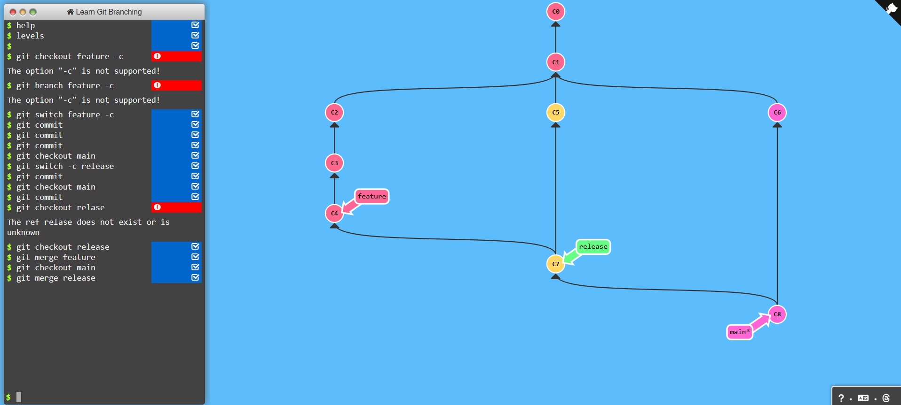

# Feature Development and Release Workflow


## Steps

1. **Switch to the feature branch** (create if necessary):
   ```bash
   git switch feature -c
   ```

2. **Commit your changes**:
   Make your necessary code changes and commit them. You can perform multiple commits as needed:
   ```bash
   git commit -m "Your commit message"
   ```

3. **Switch to the main branch**:
   ```bash
   git checkout main
   ```

4. **Create a release branch**:
   ```bash
   git switch -c release
   ```

5. **Commit any additional changes** (if necessary) on the release branch:
   ```bash
   git commit -m "Release preparation commit"
   ```

6. **Switch back to the main branch**:
   ```bash
   git checkout main
   ```

7. **Commit any final changes** (if necessary) on the main branch:
   ```bash
   git commit -m "Final changes before release"
   ```

8. **Switch to the release branch**:
   ```bash
   git checkout release
   ```

9. **Merge the feature branch into the release branch**:
   ```bash
   git merge feature
   ```

10. **Switch back to the main branch**:
    ```bash
    git checkout main
    ```

11. **Merge the release branch into the main branch**:
    ```bash
    git merge release
    ```


