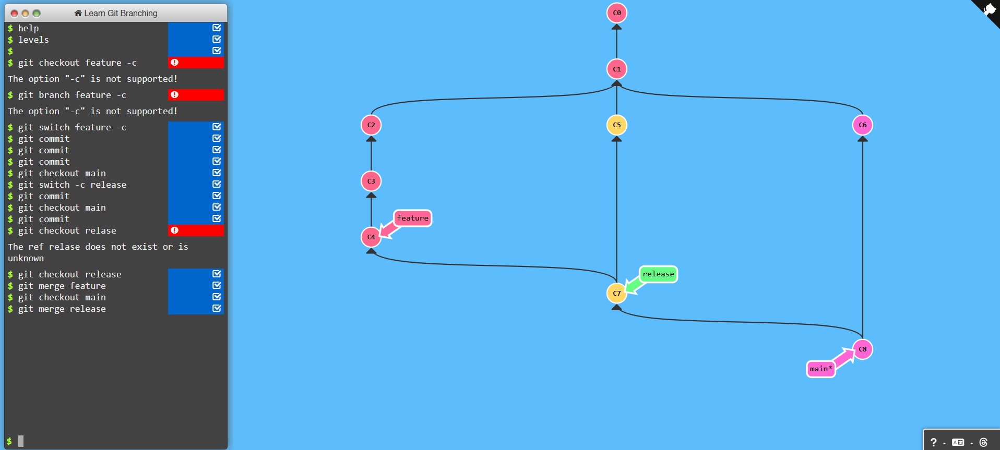
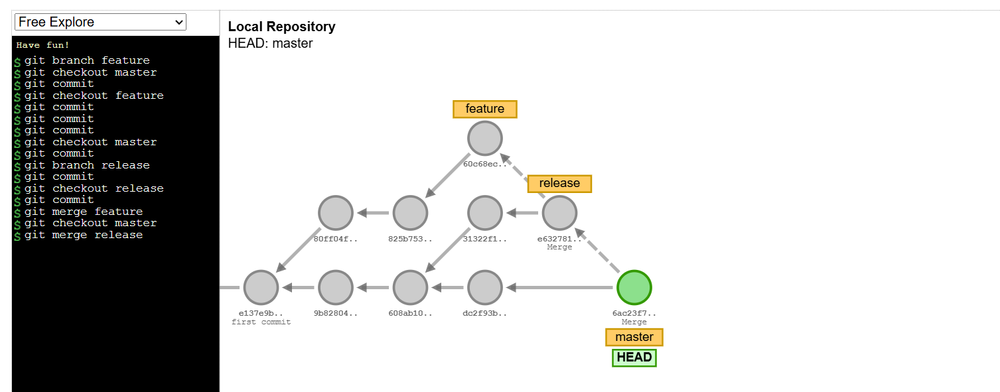
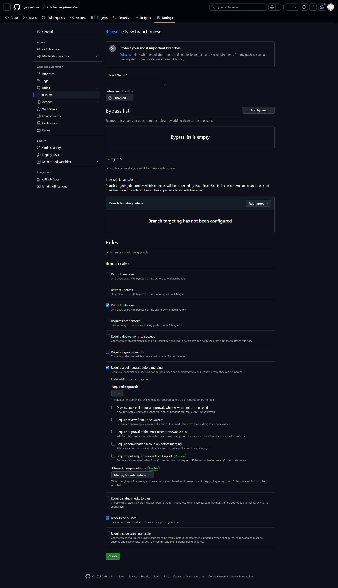
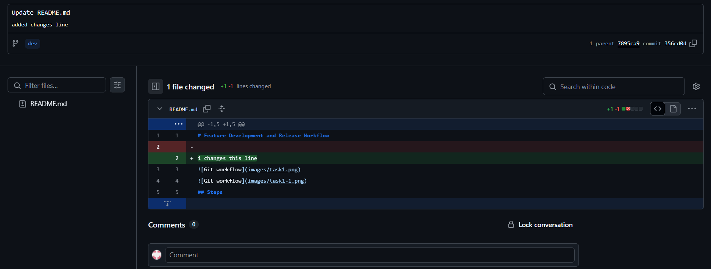
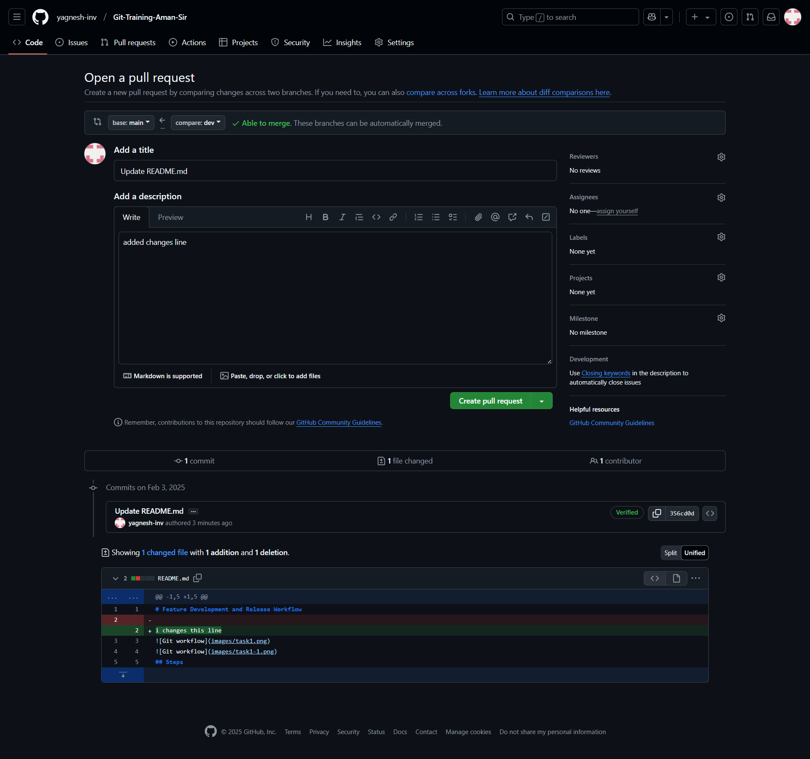
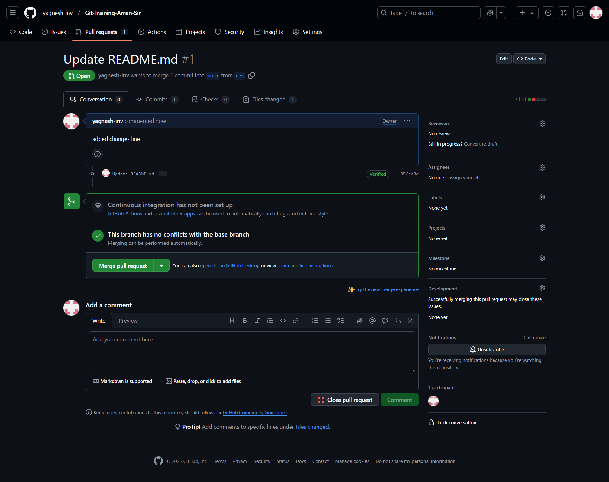
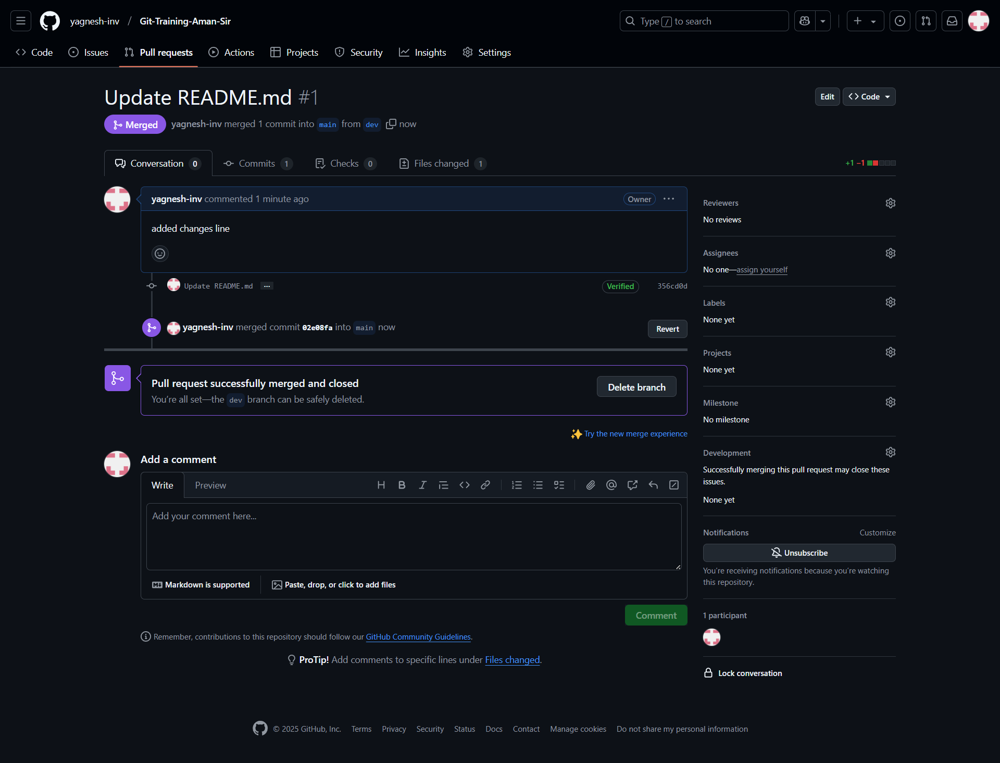

# Task 1: Feature Development and Release Workflow

## Workflow Overview

This guide outlines the steps for developing a feature, creating a release branch, and merging changes into the main branch.


### **Workflow Steps**

#### 1. Switch to the Feature Branch (Create if Necessary):
```bash
git switch -c feature
```

#### 2. Commit Your Changes:
Make necessary code changes and commit them. Multiple commits can be made as needed:
```bash
git commit -m "Your commit message"
```

#### 3. Switch to the Main Branch:
```bash
git checkout main
```

#### 4. Create a Release Branch:
```bash
git switch -c release
```

#### 5. Commit Any Additional Changes (if Necessary) on the Release Branch:
```bash
git commit -m "Release preparation commit"
```

#### 6. Switch Back to the Main Branch:
```bash
git checkout main
```

#### 7. Commit Any Final Changes (if Necessary) on the Main Branch:
```bash
git commit -m "Final changes before release"
```

#### 8. Switch to the Release Branch:
```bash
git checkout release
```

#### 9. Merge the Feature Branch into the Release Branch:
```bash
git merge feature
```

#### 10. Switch Back to the Main Branch:
```bash
git checkout main
```

#### 11. Merge the Release Branch into the Main Branch:
```bash
git merge release
```

---

# Task 2: Enforcing Git Branch Rules and Approving Commits

## **Workflow Overview**
This section describes how to enforce branch rules, make commits in the dev branch, and approve them before merging into the main branch.

### **Workflow Steps**

#### **Step 1: Set Up Branch Rules**
- Navigate to **Settings > Branches > Add Branch Ruleset**.
- Configure rules to enforce structured commits and approvals before merging.



#### **Step 2: Commit Changes in the Dev Branch**
- Switch to the `dev` branch:
  ```bash
  git switch dev
  ```
- Make a commit:
  ```bash
  git commit -m "add changes line"
  ```



#### **Step 3: Pull Changes from Dev to Main and Approve Commit**
- In the `main` branch, pull changes from `dev`:
  ```bash
  git checkout main
  git pull origin dev
  ```
- Approve the commit as per branch rules.



#### **Step 4: Approve and Merge the Commit**
- Once approved, merge the changes into `main`.



#### **Step 5: Successful Merge Confirmation**
- After merging, verify that changes are successfully applied.




